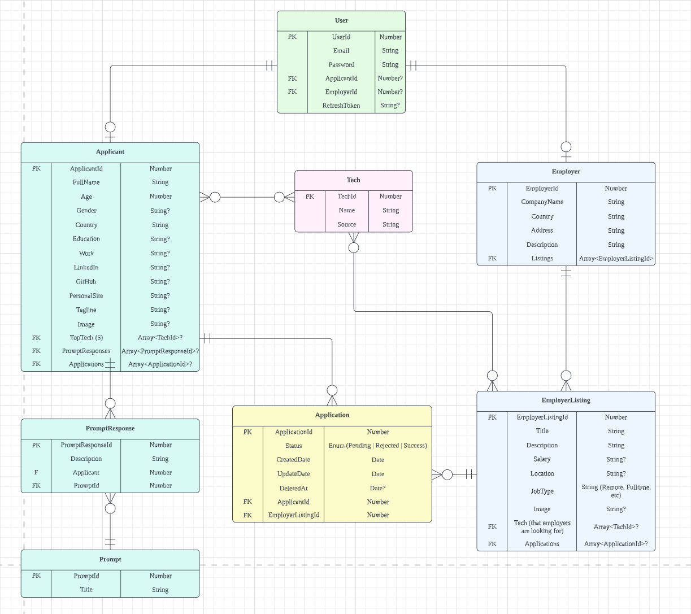

<h2 align="center"><b>DateYourJob</b></h2>

<h4 align="center">
  <b>Find your next dream job!</b>
    
  <a href="https://techfest-hackathon-2023.devpost.com/">SCSE TechFest Hackathon 2023</a>
</h4>

    <a href="https://github.com/venusnmj/date-your-job/issues/new/choose">Report Bug</a>
    ·
    <a href="https://github.com/venusnmj/date-your-job/issues/new/choose">Request Feature</a>

## 👋🏻 Introducing `DateYourJob`

    

Tired of applying for jobs endlessly but just to get ghosted in the end, wasting your time and effort in applying and preparing for the jobs?

Introducing DateYourJob, where we redefine what it means for you to promote yourself and find your dream job. Utilizing the addictive nature of swiping in dating apps, you (applicant) and employers can swipe on each other's profile or job listings to find the perfect match. ❤

## 🚀 Demo

This application is still in development!

Liked it and want to stay updated? Please give a ⭐️ to **DateYourJob**.

## 🔥 Features

**1. Applicant Profile**
- Top 5 tech skills badges for finding a good match with employer's job listings.
Profile question prompts that applicants can answer to showcase and promote their skillsets and personalities.

**2. Employer Job Listings**
- Employers can list jobs on the app with specific tech skills they are looking for and the algorithm will match them with applicants.

**3. Authentication**
- Email-based authentication with Json Web Token stored in cookies, enabling smooth and pleasant app experience.

**4. Animations**
- Smooth and pleasant animations that keep users on the application. Built using framer motion.

## 🏗️ App Architecture

### Entity Relationship Diagram

    

### Frontend

- React.js
- Tailwind CSS
- TypeScript
- HTML5
- CSS3

### Backend

- Nest.js
- Node.js
- MySQL

